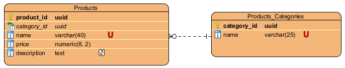
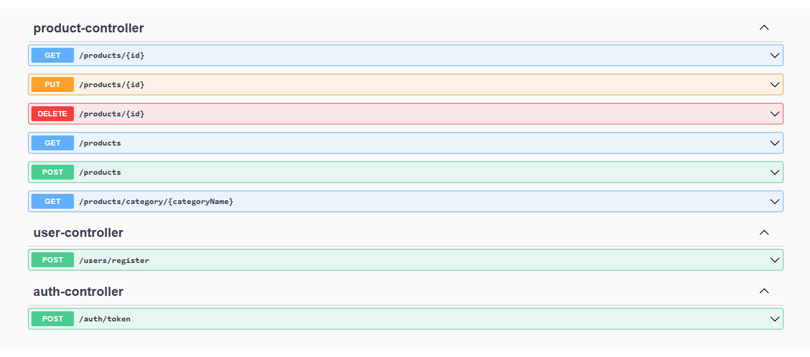
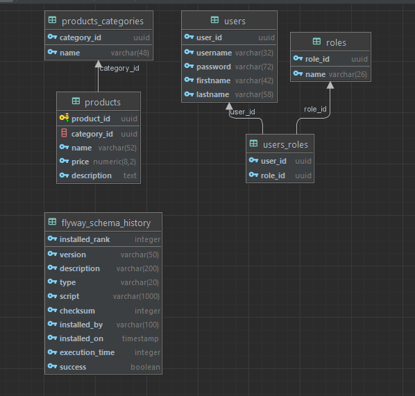

# Aplikacja do zarządzania produktami
Prosta aplikacja webowa służąca do zarządzania różnymi produktami. Aplikacja składa się z
backendu. Backend udostępnia kilka endpointów do zarządzania produktami.

## Uruchomienie
Aplikacja jest skonteneryzowana. W kontenerach tworzone są zarówno baza danych jak i backend.
W celu wygodnego uruchomienia dostarczono plik `docker-compose.yaml`. Z tego względu
uruchomienie aplikacji jest możliwe m.in. poprzez komendę:
```shell
docker-compose up
```

Jednak do uruchomienia aplikacji będzie potrzebny `Docker`.

Backend jest uruchomiony na porcie `9000` od strony komputera osoby uruchamiającej aplikację.

Przy starcie aplikacji są tworzone tabele sql i następnie tabele te są uzupełniane danymi.
Z tego względu będą już w aplikacji dostępne dane testowe. Przede wszystkim 
są tworzeni dwaj użytkownicy:

|    Użytkownik \ Dane    |    Nazwa użytkownika     |          Hasło           |
|:-----------------------:|:------------------------:|:------------------------:|
|    Zwykły użytkownik    |           user           |       KamilKamil1        |
|    Użytkownik admin     |          admin           |       KamilKamil1        |

Oprócz tego dostępne są także inne dane o produktach i kategoriach.

## 1. Spis treści:

## 2. Wymagania funkcjonalne
* Logowanie,
* Rejestracja,
* Wylogowanie
* Pobieranie listy produktów,
* Wyszukiwanie produktów po kategorii,
* Pobieranie szczegółów produktu,
* Dodawawanie nowego produktu,
* Aktualizacja produktu,
* Usuwanie produktu,
* Przygotowanie testowej aplikacji z przykładowymi danymi.

## 3. Wymagania niefunkcjonalne
### 3.1 Bezpieczeństwo
* Wszystkie endpointy w backendzie powinny być zabezpieczone,
* Istnienie roli użytkownika oraz admina,
* Modifykowanie produktów jest możliwe tylko przez admina,
* Wykorzystanie technologii JWT do zabezpieczenia aplikacji,
* Podstawowa obługa błędów w backendzie np. sprawdzanie danych wejściowych.

### 3.2 Testy:
* Testy jednostkowe repozytoriów, kontrolerów oraz serwisów,
* Testy integracyjne kontrolerów z użyciem wbudowanej bazy danych,
* Testy bezpieczeństwa dla poszczególnych ról użytkowników.

### 3.3 Technologie:
#### 3.3.1 Backend:
* Java 17,
* Spring Boot 3,
* Spring Web,
* Spring Data Jpa,
* Spring Security,
* Lombok,
* Mapstruct,
* Restassured,
* Mockito,
* Testcontainers
* Maven,
* Intellij.
#### 3.3.2 Frontend:
* JavaScript / TypeScript,
* Angular,
* Visual Studio Code.
#### 3.3.3 Inne:
* Baza danych PostgreSQL,
* Zarządzanie bazą danych poprzez PgAdmin,
* System kontroli wersji git i hosting GitHub,
* Kontrola wersji bazy danych poprzez Flyway,
* Konteneryzacja całej aplikacji z Docker i Docker Compose,
* Komunikacja między frontendem i backendem poprzez REST,
* JSON jako format wiadomości przesyłanych między frontendem i backendem,
* Modelowanie diagramu ERD bazy danych przy pomocy Visual Paradigm.

## 4. Diagram ERD
<p align="center">
    
<p>

## 5. Dokumentacja API
<p align="center">
    
<p>

## 6. Uzyskany rzeczywisty schemat bazy danych
<p align="center">
    
<p>

## Rezultaty

Udało się zaimplementować backend, dzięki któremu można wykonywać podstawowe operacje na produktach.
Niestety z powodu zbyt rozległych początkowych założeń odnośnie technologii, ostatecznie nie udało
się zaimplementować frontendu.

Backend jest zabezpieczony. Wszystkie endpointy oprócz logowania, rejestracji i swaggera są chronione
wymogiem zalogowania. Wszystkie operacje modyfikujące np. dodawanie, ooprócz rejestracji, są możliwe
do wykonania jedynie przez admina.

Aplikacja jest przetestowana na kilku warstwach i na różnych poziomach integracji. Przede wszystkim są
jednostkowe testy walidacji, mapperów oraz warstwy bezpieczeństwa kontrolerów. Oprócz tego są jeszcze
testy jednostkowe i integracyjne kontrolerów.

Udało się utrzymać w projekcie zakładane wcześniej technologie. Jak już wcześniej wspomniano,
użycie tych technologii mogło trochę spowolnić prace.

Ostatecznie udało się skonteneryzować aplikację i bazę danych.

Podsumowując, udało się zreaelizować praktycznie wszystko wymagane dla backendu a z powodu niewystarczającego
czasu oraz moich zbyt rozległych początkowych założeń, nie udało się zaimplementować frontendu. Myślę, że
było to całkiem fajne zadanie, gdzie mogłem wykorzystać nowocześniejszy stack i trochę przy tym potrenować
oraz się nauczyć niektórych rzeczy.


